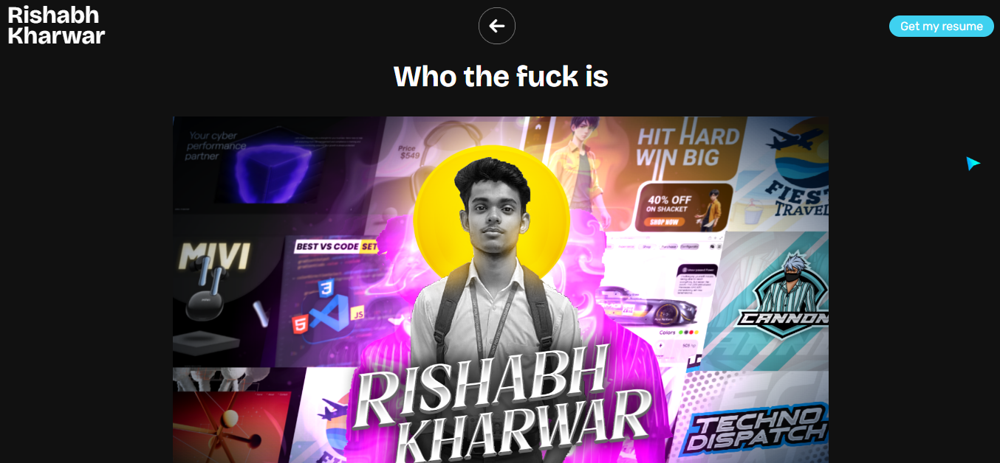

<h1>💼 Personal Portfolio</h1>

  
  
  

  

  A fully responsive personal portfolio built using <strong>HTML</strong>, <strong>CSS</strong>, <strong>JavaScript</strong>, and <strong>GSAP</strong>.

  
  

<h2>📌 Features</h2>

<ul>
  <li>📱 Fully responsive for mobile, tablet, and desktop devices</li>
  <li>✨ Smooth animations using GSAP</li>
  <li>🖼️ Interactive UI with hover effects and transitions</li>
  <li>🎨 Designed in Figma for pixel-perfect layout</li>
  <li>⚡ Fast loading and lightweight – no frameworks</li>
  <li>💡 Built in just <strong>2 days</strong></li>
</ul>

<h2>🛠️ Built With</h2>

<ul>
  <li><strong>Languages:</strong> HTML5, CSS3, JavaScript</li>
  <li><strong>Library:</strong> GSAP (GreenSock Animation Platform)</li>
  <li><strong>Tools:</strong> Figma, Photoshop CC, ChatGPT</li>
  <li><strong>Fonts:</strong> Google Fonts</li>
  <li><strong>Icons:</strong> Font Awesome</li>
</ul>

<h2>📸 Project Preview</h2>

  

<h2>📬 Contact</h2>

<ul>
  <li>Email: rixhabhk@gmail.com</li>
  <li>GitHub: <a href="https://github.com/Rixhabh-k" style="color: red; text-decoration: none;" target="_blank"  >@Rixhabh-k</a></li>
  <li>Instagram: <a href="https://www.instagram.com/rixhabh.kh/" target="_blank"  style="color: green; text-decoration: none;">Rixhabh.kh</a></li>
  <li>LinkedIn: <a href="https://www.linkedin.com/in/rishabh-kharwar-b6564b360?utm_source=share&utm_campaign=share_via&utm_content=profile&utm_medium=android_app" target="_blank"  style="color: blue; text-decoration: none;">Rixhabh Kharwar</a></li>
</ul>
